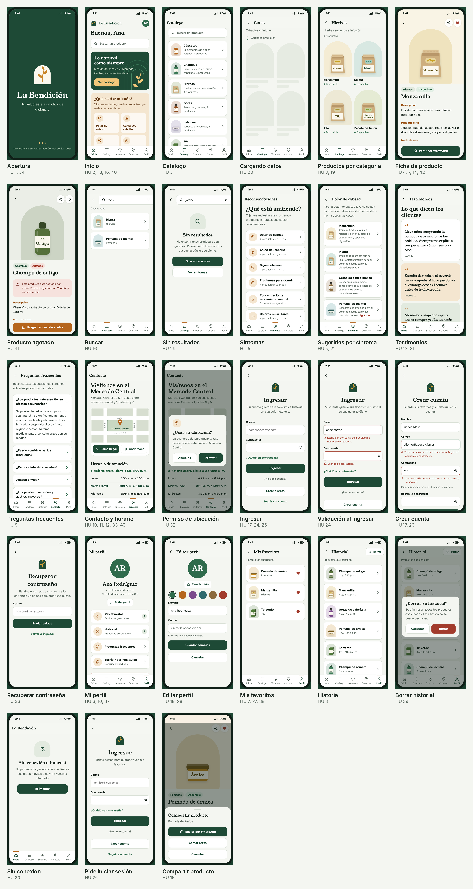

# La Bendición

Prototipo de la app móvil de La Bendición, macrobiótica del Mercado Central de San José.

Curso SC-703 Programación para Dispositivos Móviles, Universidad Fidélitas. Avance 2.

Prototipo: https://juan080305.github.io/la-bendicion-prototipo/

## Uso

En el celular se abre a pantalla completa. Desde el menú del navegador se puede agregar a la pantalla de inicio.

En la computadora se muestra dentro de un teléfono, con el índice de pantallas a la izquierda.

Cuenta de prueba: `cliente@labendicion.cr` / `bendicion123`

## Pantallas

| Pantalla | Historias de usuario |
|---|---|
| Apertura | HU 1, 34 |
| Inicio | HU 2, 13, 16, 40 |
| Catálogo y productos por categoría | HU 3, 19, 20 |
| Ficha de producto | HU 4, 7, 8, 14, 15, 38, 42 |
| Producto agotado | HU 41 |
| Buscar y búsqueda sin resultados | HU 16, 29 |
| Recomendaciones por síntoma | HU 5, 22 |
| Testimonios | HU 13, 31 |
| Preguntas frecuentes | HU 9 |
| Contacto, ubicación y horario | HU 10, 11, 12, 32, 33, 40 |
| Ingresar, crear cuenta y recuperar contraseña | HU 17, 23, 24, 25, 36 |
| Inicio de sesión requerido | HU 26 |
| Perfil y editar perfil | HU 6, 18, 28, 37 |
| Mis favoritos e historial | HU 7, 8, 27, 38, 39 |
| Sin conexión | HU 30 |
| Diseño adaptable | HU 35 |

Las capturas de cada pantalla están en la carpeta `capturas`. En `capturas/00-historias-de-usuario.png` está la lista de las 42 historias con la pantalla donde se ve cada una.

## Integrantes

- Castillo Zúñiga Pablo Andrés
- González Elizondo Génesis
- Quesada Araya Fabricio José
- Tijerino Vargas Juan José
- Valverde Durán Erick Daniel
- Vargas Navarro Fanny María

III Cuatrimestre 2026
